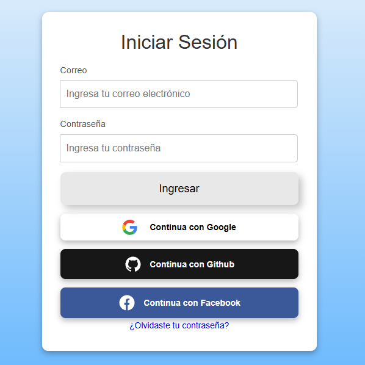
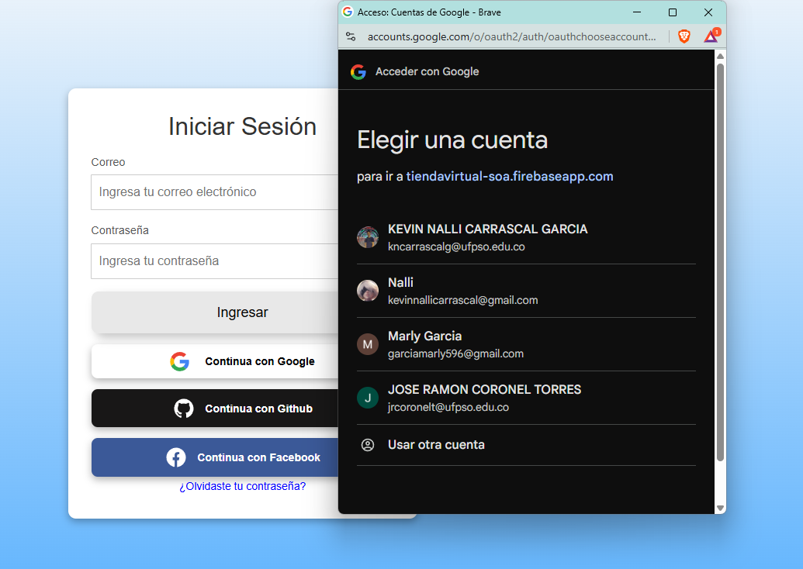
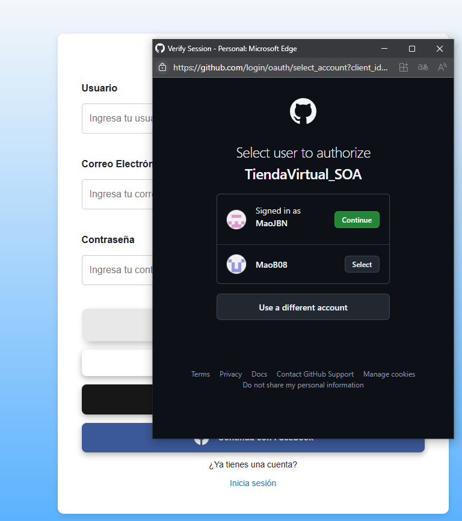

# Proyecto backend - Tienda virtual SOA

**Tienda virtual SOA**, backend para la gestión de autenticación y usuarios. Proporciona servicios para manejar la autenticación de usuarios mediante Firebase Authentication.

#### Construcción del proyecto
Este proyecto utiliza Firebase Authentication para la gestión de usuarios.

#### Tecnologías implementadas:
- Firebase Authentication: Servicio de autenticación basado en Firebase.
- AngularFire: Librería que facilita la integración de Firebase en Angular.
- TypeScript: Lenguaje de programación basado en JavaScript que añade tipado estático.

#### Funcionalidades:
Este proyecto incluye las siguientes características:
- Registro de usuarios
- Autenticación de usuarios

#### Instalación
**Antes de comenzar, asegúrate de tener instalados los siguientes programas:**
- Node.js
- Angular CLI
- Firebase CLI (Opcional, para configuraciones avanzadas)

Para instalar las dependencias necesarias, ejecuta:
```sh
npm install firebase @angular/fire
```

#### Versiones
- Node.js: v16.x o superior
- Firebase: 11.4.0
- AngularFire: Versión compatible con Angular del proyecto


## Inicio de Sesion Con Firebase Authentication

#### 🔧 Tecnologías utilizadas

- Firebase Authentication
- Firebase SDK v9+
- JavaScript / TypeScript
- Framework: [especificar si usaste React, Angular, Vanilla, etc.], en este caso Angular

---

#### 🎯 Objetivo

Permitir a los usuarios iniciar sesión en la aplicación web mediante su cuenta de Google, Facebook, y Github, utilizando Firebase Authentication de manera segura y sencilla.

---

#### 🚀 Configuración en Firebase Console

1. Ir a [https://console.firebase.google.com](https://console.firebase.google.com)
2. Seleccionar el proyecto correspondiente.
3. Ir a **Authentication** → **Método de inicio de sesión**
4. Habilitar el proveedor **Google**, **Facebook**, **Github**
5. Configurar el **correo de soporte** (requerido).
6. Guardar los cambios.

---

#### 🧩 Instalación del SDK

Instalé Firebase en el proyecto con:

```bash
npm install firebase
```

## Configuracion de Firebase en la APP

#### Dentro del archivo environments.ts
```js
import { initializeApp } from 'firebase/app';
import { getAuth } from 'firebase/auth';

const firebaseConfig = {
  apiKey: 'TU_API_KEY',
  authDomain: 'TU_AUTH_DOMAIN',
  projectId: 'TU_PROJECT_ID',
  storageBucket: 'TU_STORAGE_BUCKET',
  messagingSenderId: 'TU_SENDER_ID',
  appId: 'TU_APP_ID'
};

const app = initializeApp(firebaseConfig);
export const auth = getAuth(app);
```
## Inicio de Sesion Con Google

#### En el auth.service.ts o auth.ts
```js
import { GoogleAuthProvider, signInWithPopup } from 'firebase/auth';
import { auth } from './firebase-config';

export const loginWithGoogle = async () => {
  const provider = new GoogleAuthProvider();
  try {
    const result = await signInWithPopup(auth, provider);
    const user = result.user;
    console.log('Usuario logueado:', user.displayName, user.email);
    return user;
  } catch (error) {
    console.error('Error en el login con Google:', error);
    throw error;
  }
};
```
#### En la interfaz 
```html
<button onclick="loginWithGoogle()">Iniciar sesión con Google</button>
```
#### 🖼️ Ejemplo visual

A continuación se muestra un ejemplo del botón de inicio de sesión con Google implementado:



#### 🖼️ Ejemplo visual

Asi deberia verse al hacer click



```
## Inicio de Sesion Con GitHub

#### En el auth.service.ts o auth.ts
```js
export class LoginWithGitComponent {
  constructor(private authService: AuthService, private router: Router) {}
  loginWithGitHub(): void {
    this.authService.loginWithGitHub().subscribe(
      (userCredential) => {
        const user = userCredential.user;
        console.log('Usuario autenticado:', user);
        this.router.navigate(['/home']);  
      },
      (error) => {
        console.error('Error al autenticar con GitHub:', error);
      }
    );
  }
} 
```
#### En la interfaz 
```html
<button class="button" (click)="loginWithGitHub()"> 
    <svg fill="#ffffff" xmlns="http://www.w3.org/2000/svg" viewBox="0 0 24 24"><g stroke-width="0" id="SVGRepo_bgCarrier"></g><g stroke-linejoin="round" stroke-linecap="round" id="SVGRepo_tracerCarrier"></g><g id="SVGRepo_iconCarrier"> <title>github</title> <rect fill="none" height="24" width="24"></rect> <path d="M12,2A10,10,0,0,0,8.84,21.5c.5.08.66-.23.66-.5V19.31C6.73,19.91,6.14,18,6.14,18A2.69,2.69,0,0,0,5,16.5c-.91-.62.07-.6.07-.6a2.1,2.1,0,0,1,1.53,1,2.15,2.15,0,0,0,2.91.83,2.16,2.16,0,0,1,.63-1.34C8,16.17,5.62,15.31,5.62,11.5a3.87,3.87,0,0,1,1-2.71,3.58,3.58,0,0,1,.1-2.64s.84-.27,2.75,1a9.63,9.63,0,0,1,5,0c1.91-1.29,2.75-1,2.75-1a3.58,3.58,0,0,1,.1,2.64,3.87,3.87,0,0,1,1,2.71c0,3.82-2.34,4.66-4.57,4.91a2.39,2.39,0,0,1,.69,1.85V21c0,.27.16.59.67.5A10,10,0,0,0,12,2Z"></path> </g></svg>
    Continua con Github 
    </button>
```
#### 🖼️ Ejemplo visual

A continuación se muestra un ejemplo del botón de inicio de sesión con Github implementado:


#### 🖼️ Ejemplo visual

Asi deberia verse al hacer click



